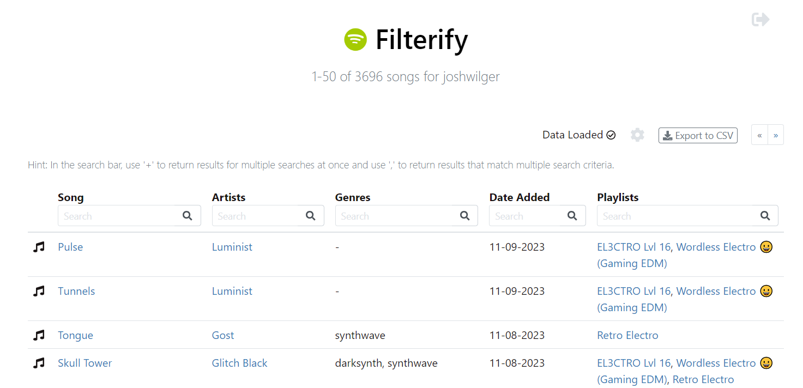
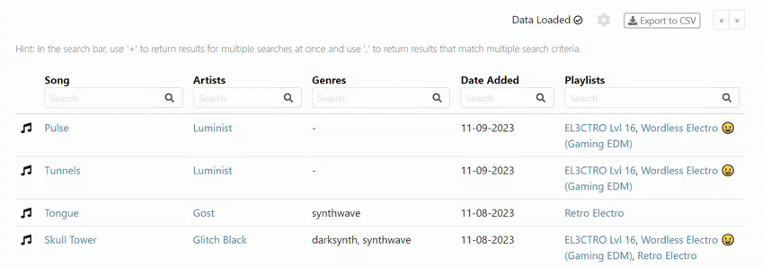
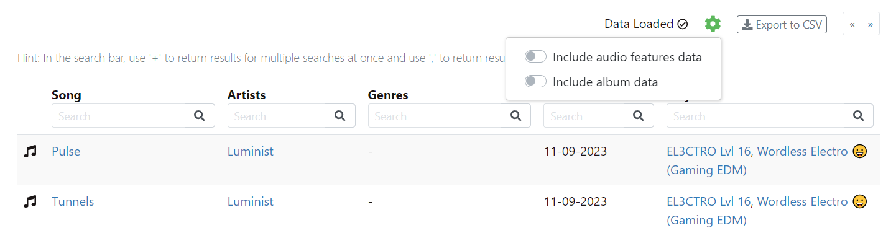

Filter and export your liked Spotify songs to [CSV](https://en.wikipedia.org/wiki/Comma-separated_values) by clicking on the link below:

[https://joshwilger.github.io/filterify/](https://joshwilger.github.io/filterify/)

A Spotify tool made using the [Spotify Web API](https://developer.spotify.com/documentation/web-api) and forked from another unrelated tool called [Exportify](https://watsonbox.github.io/exportify/). Filterify allows the user to perform detailed search queries for song genres, artists, included playlists, etc. for analysis and/or exporting a list of songs to develop more personalized playlists based on the extra song info provided by the Spotify API.

**No data will be saved - the entire application runs in the browser.**

## Usage

1. Fire up [the app](https://joshwilger.github.io/filterify/)
2. Click 'Get Started'
3. Grant Filterify read-only access to your liked songs and playlists in your library
4. Use any of the search bars to make a collection of songs
5. Click the 'Export to CSV' button to download a CSV of the filtered songs

### Importing Filtered Songs into Spotify

Once filtered tracks are saved, it's also pretty straightforward to import them into Spotify. Open up the CSV file in Excel, for example, select and copy the `spotify:track:xxx` URIs, then simply create a playlist in Spotify and paste them in. This has only been tested with the desktop app.

### Searching

To filter through your songs quickly, use any of the search bars to return a number of songs that match what you search for in the column that you search in.

To perform a more detailed search, the following keys can be used in a single search box to perform multiple operations:

* '+' adds the results of multiple search queries. Example: searching _'pop + hard rock'_ in genres will return all liked songs that have the genre Pop, along with any songs that have the genre Hard Rock.
* ',' returns the results that meet a list of multiple requirements. Example: searching _'pop, hard rock'_ in genres will return songs that have both the genre Pop and Hard Rock.

These keys can be used in combination with one another. Example: searching _'pop, hard rock + lo-fi'_ in genres will return songs that have both the Pop and Hard Rock genres, along with any songs that have the genre Lo-Fi.

Searching is _case-insensitive_. It will take some time to load song and playlist data when first loading up Filterify. Search results will be returned as soon as song data is loaded, even before playlist data is loaded.

### Export Format

Track data is exported in [CSV](http://en.wikipedia.org/wiki/Comma-separated_values) format with the following fields from the [Spotify track object](https://developer.spotify.com/documentation/web-api/reference/tracks/get-several-tracks/):

- Track URI
- Track Name
- Artist URI(s)
- Artist Name(s)
- Album URI
- Album Name
- Album Artist URI(s)
- Album Artist Name(s)
- Album Release Date
- Album Image URL (typically 640x640px jpeg)
- Disc Number
- Track Number
- Track Duration (ms)
- Track Preview URL (mp3)
- Explicit?
- Popularity
- ISRC ([International Standard Recording Code](https://isrc.ifpi.org/en/))
- Added At
- Artist Genres
- Included Playlists

By clicking on the cog, additional data can be exported.

And by selecting "Include audio features data", the following fields will be added from the [Spotify audio features object](https://developer.spotify.com/documentation/web-api/reference/tracks/get-several-audio-features/):

- Danceability
- Energy
- Key
- Loudness
- Mode
- Speechiness
- Acousticness
- Instrumentalness
- Liveness
- Valence
- Tempo
- Time Signature

Additionally, by selecting "Include album data", the following fields will be added from the [Spotify album object (full)](https://developer.spotify.com/documentation/web-api/reference/object-model/#album-object-full)

- Album Genres
- Label
- Copyrights

Note that the more data being exported, the longer the export will take.

## Development

See the documentation from the [forked repository](https://github.com/watsonbox/exportify/).

## Notes

- Unfortunately, this project suffers from a very long load time after authentication. This is to gather all the data required for searching. I am a junior developer and this is a solo project made mostly to gain experience in using APIs. If anyone finds this project useful and would like to improve upon it in this way, that'd be amazing - I'm just not really cut out for improving load times right now.

- The functionality of searching multiple columns at once is currently not available. I tried tackling this problem once, but had to put it on hold due to time constraints. I would like to resolve this soon.

- The original project this is forked from has gone to lengths to try to eliminate errors resulting from excessively high usage of the Spotify API. Nonetheless, exporting data in bulk is a fairly request-intensive process, so please do try to use this tool responsibly. If you do require more throughput, please consider creating your own Spotify application which you can use with Filterify directly.

- Disclaimer: It should be clear, but this project is not affiliated with Spotify in any way. It's just an app using their API like any other, with a cheeky name and logo 😇.

## Error Monitoring

Error monitoring provided by Bugsnag.

